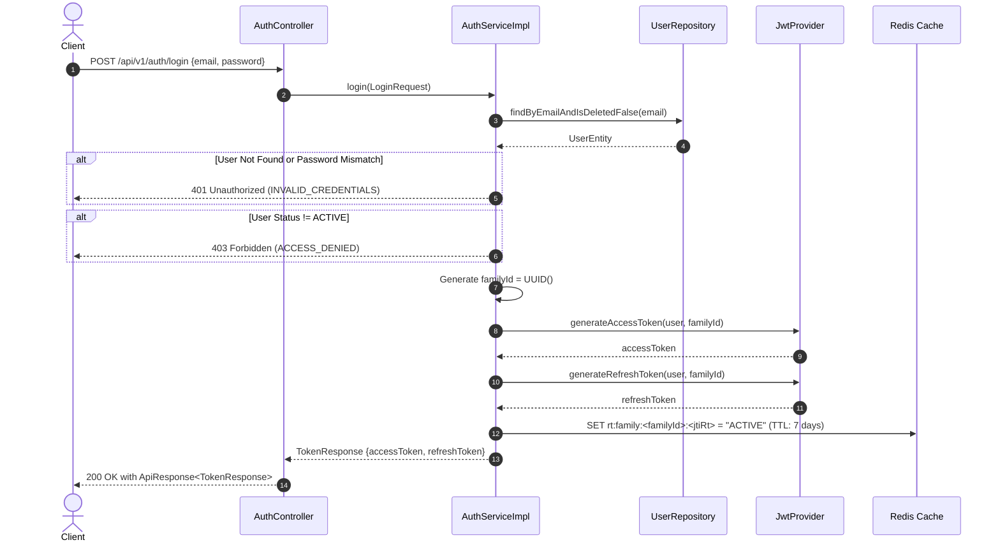
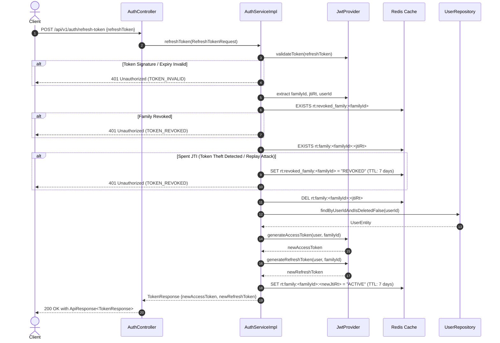
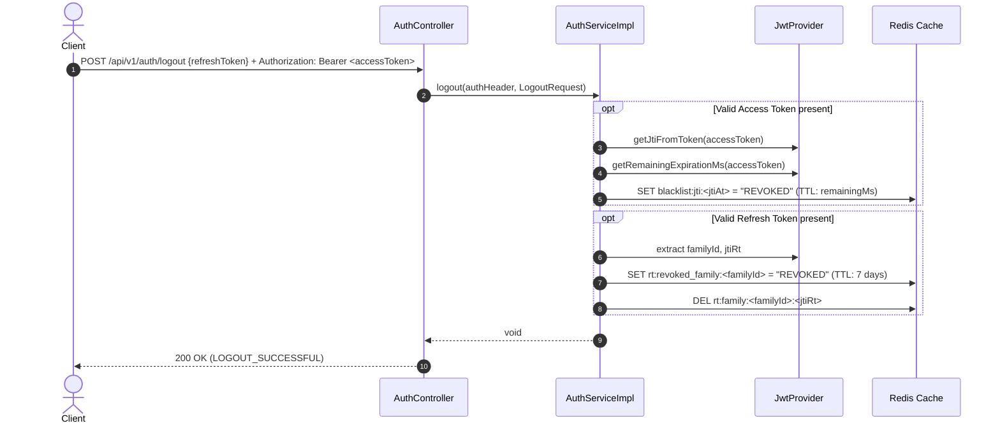

# Authentication & Token Management Architecture Specification

## 1. Overview & Security Architecture

Túi Khôn Backend implements a stateless, secure **JWT Authentication & Token Management System** powered by Spring Security, JWT (jjwt 0.12.x), and Redis.

### Key Security Design Patterns

1. **Direct Credential Authentication**:
   - **Login (`POST /api/v1/auth/login`)**: Email and Password verification directly returns an `accessToken` and `refreshToken` pair bound to a unique Token Family.
2. **Instant Access Token Blacklisting**:
   - Access tokens contain a unique JWT ID (`jti`). Upon logout, the `jti` is stored in Redis (`blacklist:jti:<jti>`) with a TTL matching the token's remaining lifespan, ensuring instant stateless revocation.
3. **Token Family Rotation (Mitigating Refresh Token Theft)**:
   - Every Refresh Token belongs to a `familyId`.
   - When a Refresh Token is used (`POST /api/v1/auth/refresh-token`), it is rotated (a new Refresh Token JTI is issued under the same `familyId`).
   - If an old or spent Refresh Token JTI is presented (Replay Attack), the system detects token theft and immediately revokes the **entire Token Family** (`rt:revoked_family:<familyId>`).
4. **Role-Based Access Control (RBAC)**:
   - Enforcing system roles via `RoleName` Enum (`USER`, `ADMIN`) embedded directly in `UserEntity`.

---

## 2. Redis Key Structure & TTL Specifications

| Key Pattern | Data Type | Purpose | TTL |
| :--- | :--- | :--- | :--- |
| `rt:family:<familyId>:<jtiRt>` | String | Identifies active Refresh Token JTI within token family | 7 days (`REFRESH_FAMILY_TTL_DAYS`) |
| `rt:revoked_family:<familyId>` | String | Marks entire Token Family as revoked upon theft/logout | 7 days (`REFRESH_FAMILY_TTL_DAYS`) |
| `blacklist:jti:<jtiAt>` | String | Blacklists Access Token JTI upon logout | Remaining AT lifespan (ms) |

---

## 3. Sequence Diagrams

### 3.1 Login Flow (`POST /api/v1/auth/login`)

### 3.2 Token Refresh Flow with Rotation (`POST /api/v1/auth/refresh-token`)

### 3.3 Logout Flow (`POST /api/v1/auth/logout`)

