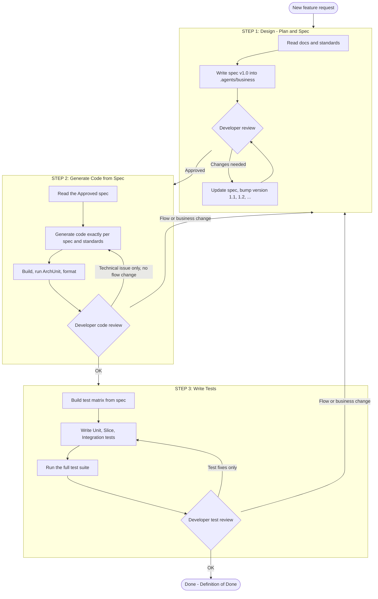
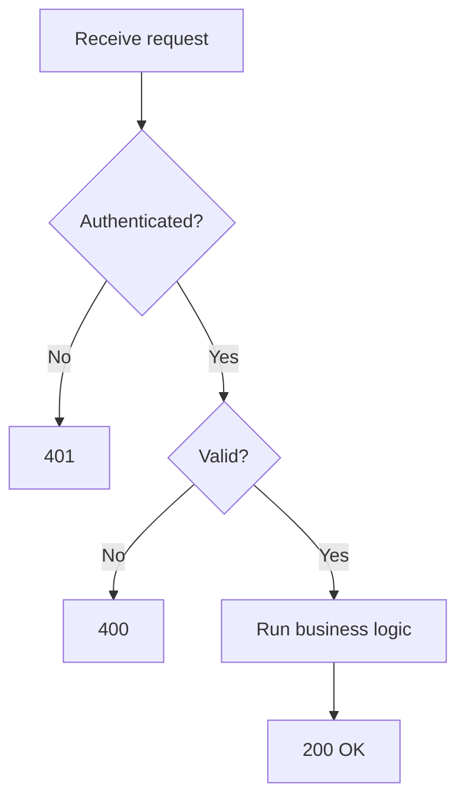
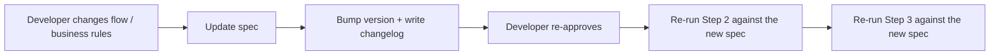

# FEATURE DEVELOPMENT WORKFLOW

> **Suggested location:** `.agents/overview/FEATURE_WORKFLOW.md`
> **Applies to:** the `tui_khon_be` project (Spring Boot + Maven + JPA + Redis)
> **Audience:** Developers and AI Agents
> **Document version:** 1.0

---

## 1. Purpose

Standardize how a new feature is delivered using a **Spec-Driven Development** approach:

1. **Design first** (the document is the single source of truth).
2. **Generate code exactly as documented**, with no additions or omissions.
3. **Write tests that follow the document and the business rules**.

Any change to the business flow **must** go back to Step 1 to update the document, then the process is re-run. Never patch code "silently" outside the specification.

---

## 2. Core Principles

| # | Principle | Explanation |
|---|-----------|-------------|
| 1 | **Spec is the Single Source of Truth** | Code and tests are generated only from a spec that the developer has approved. |
| 2 | **No extra context** | The Agent must not add any field, endpoint, rule, table, or library that is not in the spec. |
| 3 | **Flow change = back to Step 1** | If the developer wants to change the flow in Step 2 or 3, update the spec (bump the version) and re-run from the beginning. |
| 4 | **Human-in-the-loop** | The developer must approve the spec before Step 2. The Agent never approves on its own. |
| 5 | **Follow project standards** | Always read `.agents/rules/*` and `.agents/spring-boot/*` before designing and coding. |
| 6 | **Traceability** | Every class, method, and test case can be traced back to a step in the spec. |
| 7 | **Security and performance are mandatory** | SQL Injection prevention, N+1 avoidance, and query optimization are handled at design time. |

---

## 3. Required Reading Before Starting

The Agent **must read** the following files before every workflow run:

| Group | File | Used in step |
|-------|------|--------------|
| Overview | `.agents/overview/TuiKhon_Development_Document.md` | S1, S2, S3 |
| Existing business specs | `.agents/business/*.md` (e.g. `AUTHENTICATION_SPEC.md`) | S1 (avoid duplication, enable reuse) |
| Coding standards | `.agents/rules/CODING_STANDARDS.md` | S2 |
| Naming conventions | `.agents/rules/NAMING_CONVENTIONS.md` | S1, S2, S3 |
| DB migration standards | `.agents/rules/DATABASE_MIGRATION_STANDARDS.md` | S1, S2 |
| Spring Boot skill | `.agents/spring-boot/SKILL.md` | S2, S3 |
| Maven configuration | `.agents/spring-boot/references/spring-boot-maven-config.md` | S2 |
| Testing | `.agents/spring-boot/references/testing-*.md`, `spring-boot-rest-api-testing.md` | S3 |
| Architecture checks | `.agents/spring-boot/references/archunit.md` | S2, S3 |
| General agent rules | `.agents/AGENTS.md` | S1, S2, S3 |

---

## 4. Process Overview



---

## 5. STEP 1: Feature Design (Plan and Spec)

### 5.1. Goal
Produce **a single spec file** that fully describes the feature for developer review. The spec must be detailed enough that Step 2 can generate code **without asking questions or guessing**.

### 5.2. Input
- The developer's requirement description (Vietnamese or English).
- The documents listed in section 3.

### 5.3. Output
- File: `.agents/business/<FEATURE_NAME>_SPEC.md`
- `<FEATURE_NAME>`: `UPPER_SNAKE_CASE`, e.g. `ORDER_CREATE_SPEC.md`, `USER_PROFILE_SPEC.md`.
- Initial state: `Version 1.0 - Status: DRAFT`.

### 5.4. Tasks for the Agent
1. Read existing business specs to **reuse** enums, DTOs, exceptions, and constants, and to avoid duplication.
2. Analyze the requirement and list **assumptions** and **open questions** if any. Do not decide unclear points on your own; record them under Open Questions for the developer to answer.
3. Draw **flowcharts** (Mermaid) for the main flow, error flows, and exception flows.
4. Describe **each processing step** in execution order (see 5.6).
5. Write **SQL** for each data access step, together with security and performance analysis.
6. Build the **Error Catalog**: HTTP status, error code, and a specific message.
7. Declare **request and response DTOs** and validation rules.
8. List **files to create or modify**, following the project's package structure.
9. Record the **changelog** and review status.

### 5.5. Spec Versioning Rules

| Situation | Version | Example |
|-----------|---------|---------|
| First draft created by the Agent | `1.0` | `1.0` |
| Developer review requests small changes (add validation, change a message, fix SQL, add a minor step) | bump **minor** | `1.0` → `1.1` → `1.2` |
| Main flow change, API contract change, adding or removing a business step, table structure change | bump **major** | `1.x` → `2.0` |
| Typo or formatting fix with no change in meaning | keep version, note it in the changelog | - |

**Mandatory rules:**
- Every time the developer requests a change, the Agent **must not overwrite history**: add a row to the Changelog (version, date, requester, what changed, why).
- Only when the developer explicitly writes **"Approved"** does the status change to `APPROVED` and Step 2 become allowed.
- Generated code and tests must state the **spec version** they were built from (see sections 6 and 7).

### 5.6. How to Write "Detailed Processing Steps"

Each step must contain: **Purpose, Input, Action, Error conditions and messages, Layer.** Example:

| Step | Description | Error on failure |
|------|-------------|------------------|
| 1 | Check authentication (JWT valid, not expired, not in the Redis blacklist) | `401 AUTH_UNAUTHORIZED` |
| 2 | Check authorization (role is allowed to call the API) | `403 AUTH_FORBIDDEN` |
| 3 | Validate request body (`@Valid`, `RequireField`, `EnumValue`) | `400 VALIDATION_ERROR` |
| 4 | Check that the user exists and is `ACTIVE` | `404 USER_NOT_FOUND` or `403 USER_INACTIVE` |
| 5 | Check business rules (duplicate data, valid state, etc.) | `409 <CODE>` |
| 6 | Execute the business logic inside a transaction | `500 INTERNAL_ERROR` |
| 7 | Map Entity to DTO via Helper and return `ApiResponse` | - |

### 5.7. Mandatory SQL and Performance Requirements

Every query in the spec **must** cover all of the following:

**A. SQL Injection Prevention**
- Use only **Spring Data JPA derived queries**, **JPQL**, or **native queries with named/positional parameters** (`:param`, `?1`).
- **Never** concatenate user input into SQL/JPQL strings.
- For `ORDER BY` and dynamic column names: use a **whitelist** (map from an enum, e.g. `BaseSortCondition` + `SortOrder`). Never accept raw column names from the client.
- `LIKE` searches: escape `%` and `_` and pass the value as a parameter.
- State explicitly in the spec: *"This query uses parameter binding"*, with a snippet.

**B. Avoiding N+1 Queries**
- For every association (`@ManyToOne`, `@OneToMany`, ...) the spec must state the **fetch strategy**: `JOIN FETCH`, `@EntityGraph`, `@BatchSize`, or **DTO projection**.
- Default to `LAZY`. Do not use `EAGER`.
- For lists: state the **expected number of queries** (e.g. "1 count query + 1 data query").
- When paginating a list that includes a `@OneToMany` association: use two steps (fetch IDs for the page, then fetch details with `IN`) to avoid in-memory pagination.

**C. Query Optimization**
- `SELECT` only the required columns (projection) for large read queries.
- **Pagination is mandatory** (`PageRequest`, `PageResponse`) for every list API; enforce a maximum `size` (e.g. 100).
- Propose **indexes** for columns used in `WHERE`, `JOIN`, `ORDER BY`, and state the **index type** (B-Tree, composite, unique, partial).
- Include the expected **`EXPLAIN`** output or a complexity note for complex queries.
- Avoid `SELECT *`. Avoid functions on indexed columns in `WHERE` (e.g. `LOWER(col)` without a functional index).
- Consider **Redis caching** for read-heavy, rarely-changing data: state the key, TTL, and invalidation conditions.
- For bulk writes: use **batch insert/update**, not a `save()` loop per row.

**D. Transactions and Concurrency**
- State the `@Transactional` scope (read-only or not) and the isolation level if it differs from the default.
- Describe the race-condition protection when needed: unique constraint, optimistic lock (`@Version`), pessimistic lock, or Redis lock.

**E. Migration**
- If the schema changes: describe the migration script per `DATABASE_MIGRATION_STANDARDS.md` (file name, up, rollback if applicable).

### 5.8. Error Message Rules

- Messages must be **clear, concise, and client-facing**, and must **not expose** internal details (stack traces, table names, SQL statements).
- Clearly distinguish: validation error (400), unauthenticated (401), forbidden (403), not found (404), conflict (409), system error (500).
- Every error has a **stable error code** (usable for client-side logic) and a **message**.
- Prefer declaring them in `MessageConstant`; the spec must list the keys and message texts.
- Do not disclose sensitive information. For example, a failed login returns "Email or password is incorrect" and never says which of the two was wrong.

### 5.9. Spec Template (copy to use)

````markdown
# <FEATURE NAME> SPEC

## 0. Metadata
| Field | Value |
|-------|-------|
| Feature name | <Name> |
| Feature code | <FEATURE_NAME> |
| API version | v1 (`/api/v1/...`) |
| Created date | YYYY-MM-DD |
| Requested by | <developer> |
| Spec version | 1.0 |
| Status | DRAFT / IN_REVIEW / APPROVED |

## 1. Overview
- Business goal:
- In scope:
- Out of scope:
- Assumptions:
- Open questions:

## 2. API Overview
| Method | Endpoint | Auth | Role | Description |
|--------|----------|------|------|-------------|
| POST | `/api/v1/...` | Bearer JWT | USER | ... |

### 2.1. Request
| Field | Type | Required | Validation | Description |
|-------|------|----------|------------|-------------|

### 2.2. Success Response
```json
{ "success": true, "data": {}, "message": "...", "traceId": "..." }
```

## 3. Flowchart


## 4. Detailed Processing Steps
### Step 1: <Step name>
- Layer: Controller / Service / Repository
- Input:
- Action:
- Error condition: `<HTTP> <CODE>` - "<message>"

### Step 2: ...

## 5. Data Design and SQL
### 5.1. Tables and Schema Changes
### 5.2. Queries per Step
| Step | Purpose | Type (JPQL/Native/Derived) | Index used | Query count |
|------|---------|----------------------------|------------|-------------|

```sql
-- Step 2: check that the user exists (parameter binding)
SELECT u.id, u.email, u.status
FROM users u
WHERE u.id = :userId AND u.deleted_at IS NULL;
```

### 5.3. Proposed Indexes
### 5.4. Migration

## 6. Security
- [ ] SQL Injection prevention (parameter binding, sort whitelist)
- [ ] Authorization and ownership checks (prevent IDOR)
- [ ] No sensitive data in logs
- [ ] Rate limiting / brute-force protection (if needed)
- [ ] Mask sensitive data in responses

## 7. Performance
- [ ] No N+1 (state the fetch strategy)
- [ ] Pagination and size limit
- [ ] Appropriate indexes
- [ ] Cache (key, TTL, invalidation)
- [ ] Reasonable transaction scope

## 8. Error Catalog
| HTTP | Error code | Message | When |
|------|------------|---------|------|

## 9. Files to Create / Modify
| Layer | File | Action |
|-------|------|--------|
| controller | `XxxController` | Create |
| dto.request | `XxxRequest` | Create |
| service | `XxxService`, `impl/XxxServiceImpl` | Create |
| repository | `XxxRepository` | Modify |
| constant | `MessageConstant` | Modify |

## 10. Test Scenarios (input for Step 3)
| ID | Related step | Scenario | Expected result |
|----|--------------|----------|-----------------|

## 11. Changelog
| Version | Date | Requested by | Change | Reason |
|---------|------|--------------|--------|--------|
| 1.0 | YYYY-MM-DD | Agent | Initial version | - |

## 12. Review
| Reviewer | Date | Result | Notes |
|----------|------|--------|-------|
````

### 5.10. Checklist Before Sending for Developer Review
- [ ] Complete metadata, version `1.0`, created date.
- [ ] Flowchart covers the main flow and error flows.
- [ ] Every step has Input, Action, Error, Layer.
- [ ] Every query has SQL, parameter binding, an N+1 strategy, and indexes.
- [ ] Error Catalog is complete, messages are clear, no internal details leaked.
- [ ] The file list matches the project's package structure.
- [ ] Test scenarios exist in section 10.
- [ ] All uncertain points are listed under Open Questions.

### 5.11. Approval Gate (Gate 1)
- The Agent submits the spec and **stops to wait for the developer**.
- The developer responds with one of:
  - **"Change: ..."** → the Agent updates the spec, bumps the version, writes the changelog, and resubmits.
  - **"Approved"** → the Agent sets `Status = APPROVED`, records it in the Review section, and moves to Step 2.

---

## 6. STEP 2: Generate Code from the Spec

### 6.1. Goal
Generate code that matches the **APPROVED spec 100%**. No additions, no omissions, no "improvements" beyond the document.

### 6.2. Preconditions
- The spec status is `APPROVED`.
- The Agent records the **spec version** used, e.g. `Spec: ORDER_CREATE_SPEC.md v1.2`.

### 6.3. Mandatory Rules

| # | Rule |
|---|------|
| 1 | Only create or modify files listed in the spec's **"Files to Create / Modify"** section. |
| 2 | Do not add any field, endpoint, validation, business log, library, or table that is not in the spec. |
| 3 | The processing order in code must **match the step order** in the spec. Each step carries a short reference comment, e.g. `// Spec step 2: check that the user exists`. |
| 4 | Error messages, error codes, and HTTP statuses come **exactly from the Error Catalog**. Declare them in `MessageConstant`; never hard-code strings. |
| 5 | SQL/JPQL matches the spec; use parameter binding; the fetch strategy is exactly as chosen. |
| 6 | Follow `CODING_STANDARDS.md`, `NAMING_CONVENTIONS.md`, `DATABASE_MIGRATION_STANDARDS.md`, and `spring-boot/SKILL.md`. |
| 7 | Respect the layering: `controller` → `service` → `repository`; Entity ↔ DTO mapping lives in `helper`. Controllers contain no business logic. |
| 8 | Reuse existing components: `ApiResponse`, `PageRequest`, `PageResponse`, `HttpException`, `GlobalExceptionHandler`, `BaseEntity`, validators such as `EnumValue` and `RequireField`. |
| 9 | Do not change the design of shared components (security, config) unless the spec requires it. |
| 10 | If the spec is **missing, contradictory, or infeasible**: **STOP**, notify the developer, and propose going back to Step 1. **Do not work around it on your own.** |

### 6.4. Procedure
1. Read the APPROVED spec and the standards in section 3.
2. Plan the files from section 9 of the spec (suggested order: migration/entity → repository → dto → constant/exception → helper → service interface + impl → controller → config if needed).
3. Generate the code.
4. Self-check:
   - `./mvnw clean compile` (or `./mvnw -q -DskipTests package`) must succeed.
   - Run ArchUnit (see `references/archunit.md`) if architecture tests exist.
   - Cross-check each spec step against the code (traceability table).
5. Produce the **Step 2 report** (see 6.5).

### 6.5. Step 2 Final Report

```markdown
## Step 2 Report
- Spec: <FEATURE_NAME>_SPEC.md - version <x.y>
- Files created: ...
- Files modified: ...
- Traceability:
  | Spec step | Class#method |
  |-----------|--------------|
  | Step 1 | XxxController#create |
  | Step 2 | XxxServiceImpl#create (line ...) |
- Build: PASS / FAIL
- ArchUnit: PASS / FAIL / N/A
- Deviation from spec: NONE (or list them and propose going back to Step 1)
```

### 6.6. Approval Gate (Gate 2) and Handling Changes

When the developer reviews the code, there are **two kinds of feedback**, handled differently:

| Feedback type | Examples | Action |
|---------------|----------|--------|
| **Technical issue, no flow change** | Wrong variable name, missing import, compile error, naming violation, syntax error, code that does not match the spec | Fix in Step 2 and **keep the spec version unchanged**. |
| **Flow or business change** | Add a check step, change a condition, change a message, change SQL, change the response, add a field | **GO BACK TO STEP 1**: update the spec (bump version), get developer approval again, then **re-run Step 2 and Step 3 from the beginning**. |

> **Never** edit code directly to satisfy a flow change without updating the spec. If it is unclear which category a request belongs to, the Agent **asks the developer** or defaults to treating it as a flow change.

---

## 7. STEP 3: Write Tests for the Feature and Business Rules

### 7.1. Goal
Prove that the code **behaves correctly against the spec**, covering the main flow, error flows, and edge cases.

### 7.2. Preconditions
- The Step 2 code has been approved by the developer.
- The spec is still the same `APPROVED` version used in Step 2.

### 7.3. Procedure
1. Read **section 10 (Test Scenarios)** and **section 8 (Error Catalog)** of the spec, and read the `references/testing-*.md` files.
2. Build a **Test Matrix**: every step and every error row in the spec has at least one test case.
3. Write tests at the right layer (see 7.4).
4. Run `./mvnw test` (and `./mvnw verify` if integration tests exist).
5. Produce the **Step 3 report**.

### 7.4. Test Layers

| Type | Scope | Suggested tools | Reference |
|------|-------|-----------------|-----------|
| **Unit test** | `ServiceImpl`, `Helper`, `Util`, validators; mock repositories | JUnit 5, Mockito, AssertJ | `testing-unit-mocking.md` |
| **Web slice** | Controller: routing, validation, status codes, JSON, exception handling | `@WebMvcTest`, MockMvc | `testing-slices-web.md`, `spring-boot-rest-api-testing.md` |
| **Persistence slice** | Repository, custom queries, N+1 checks | `@DataJpaTest`, Testcontainers | `testing-slices-persistence.md` |
| **Integration test** | End-to-end from HTTP to DB (and Redis when relevant) | `@SpringBootTest`, Testcontainers | `testing-integration.md` |
| **Architecture test** | Layering, naming, dependency rules | ArchUnit | `archunit.md` |

Overall strategy follows `testing-strategy.md`.

### 7.5. What Tests Must Cover

- [ ] **Happy path** of every API.
- [ ] **Every row in the Error Catalog**: verify the exact HTTP status, error code, and message.
- [ ] **Validation**: missing fields, wrong format, invalid enum, exceeding length, boundary values.
- [ ] **Authentication and authorization**: no token, expired token, wrong role, accessing another user's data.
- [ ] **Business rules**: every branch in the flowchart.
- [ ] **Queries**: correct results; correct pagination; sort whitelist (sorting by an invalid column is rejected).
- [ ] **SQL Injection**: send payloads such as `' OR '1'='1` and `'; DROP TABLE users; --` into search, sort, and filter parameters → results are unaffected and no 500 error occurs.
- [ ] **N+1**: persistence/integration tests confirm the **number of queries** matches the spec (e.g. using Hibernate Statistics or datasource-proxy).
- [ ] **Concurrency** (if in the spec): two concurrent requests do not violate constraints.
- [ ] **Transaction rollback** when a failure occurs midway.
- [ ] **Standard response format** (`ApiResponse`, `traceId`).

### 7.6. Test Writing Conventions
- Name tests per `NAMING_CONVENTIONS.md`; suggested method name: `should_<result>_when_<condition>`.
- Use **Given – When – Then** (Arrange – Act – Assert).
- Each test verifies **one behavior**; tests are independent and do not rely on execution order.
- Each test references the **scenario ID** from the spec (e.g. `// TC-05 (Spec step 4)`).
- Do not write tests for behavior that is **not in the spec**.
- Avoid heavy mocking in integration tests; use Testcontainers for DB and Redis instead of H2 when the engine differs from production.

### 7.7. Step 3 Final Report

```markdown
## Step 3 Report
- Spec: <FEATURE_NAME>_SPEC.md - version <x.y>
- Test files: ...
- Test Matrix:
  | Spec ref | Test ID | Test method | Type | Result |
  |----------|---------|-------------|------|--------|
- Total: X tests, PASS: x, FAIL: x
- Coverage (if available): line x%, branch x%
- Spec deviations / bugs found: NONE (or list them)
```

### 7.8. Approval Gate (Gate 3) and Handling Changes

| Situation | Action |
|-----------|--------|
| Test fails because of a **code bug** (code deviates from the spec) | Go back to **Step 2** and fix the code, keep the spec unchanged, then re-run Step 3. |
| Test fails because the **test is wrong** | Fix the test in Step 3. |
| Developer wants to **change the flow / business rules** | **GO BACK TO STEP 1**, update the spec (bump version), get approval, then **re-run Step 2 and Step 3 from the beginning**. |
| Tests reveal the **spec is wrong or incomplete** | Notify the developer and propose going back to Step 1. |

---

## 8. Rules for Returning to Step 1 (Change Request)



**When returning to Step 1, the Agent must:**
1. Record the change request in the spec's Changelog (new version, date, reason).
2. Update **every** affected section: flowchart, steps, SQL, Error Catalog, file list, test scenarios. Do not fix only one place.
3. Clearly mark changes relative to the previous version (e.g. tag `[CHANGED v1.1]`, `[NEW v1.1]`, `[REMOVED v1.1]`).
4. Wait for the developer to `Approve` again.
5. When re-running Steps 2 and 3: **compare existing code and tests against the new spec**, remove what is now redundant, fix what deviates, and add what is missing. Leave no "orphaned" code or tests from the old flow.

---

## 9. Feature Status Lifecycle

| Status | Meaning | Next step |
|--------|---------|-----------|
| `DRAFT` | The Agent has just created the spec | Send to developer for review |
| `IN_REVIEW` | Developer is reviewing / requesting changes | Update and bump version |
| `APPROVED` | Developer approved the spec | Step 2 |
| `CODING` | Code is being generated | Step 2 |
| `CODE_REVIEW` | Waiting for developer to approve code | Gate 2 |
| `TESTING` | Tests are being written/run | Step 3 |
| `TEST_REVIEW` | Waiting for developer to approve tests | Gate 3 |
| `DONE` | Completed | - |
| `CHANGE_REQUESTED` | Developer changed the flow, back to Step 1 | Step 1 |

---

## 10. Definition of Done (DoD)

A feature is considered **done** when:

- [ ] The spec is `APPROVED`, the changelog is complete, and the final version is recorded.
- [ ] Code matches the spec 100% (with a traceability table) and contains nothing outside the spec.
- [ ] All standards in `.agents/rules` and `.agents/spring-boot` are followed.
- [ ] The build succeeds: `./mvnw clean verify`.
- [ ] All tests PASS; every step and every Error Catalog row has a test.
- [ ] ArchUnit PASS (if applicable).
- [ ] Verified: no SQL Injection, no N+1, queries have suitable indexes.
- [ ] No secrets or credentials in code; environment variables added to `.env.example` if needed.
- [ ] Related documents updated (`TuiKhon_Development_Document.md`, `README.md`, OpenAPI if needed).
- [ ] The developer confirmed all 3 approval gates.

---

## 11. Sample Prompts for the Agent

### 11.1. Trigger Step 1
```text
Execute STEP 1 per .agents/overview/FEATURE_WORKFLOW.md for the following feature:

Feature name: <...>
Requirement description: <...>
API version: v1

Requirements:
- Read the required documents in section 3 before starting.
- Create .agents/business/<FEATURE_NAME>_SPEC.md, version 1.0, status DRAFT.
- Include flowcharts, detailed steps, SQL, security, N+1 handling, query optimization, and the Error Catalog.
- Record anything unclear under Open Questions; do not guess.
- Stop and wait for my review.
```

### 11.2. Request Spec Changes
```text
Update <FEATURE_NAME>_SPEC.md:
- <change 1>
- <change 2>
Bump the version per section 5.5, write the changelog, and mark the changed parts.
```

### 11.3. Approve Spec and Trigger Step 2
```text
Spec <FEATURE_NAME>_SPEC.md v<x.y> APPROVED.
Execute STEP 2: generate code exactly per the spec, with no additions or omissions.
Follow .agents/rules and .agents/spring-boot.
Produce the Step 2 report including the traceability table.
```

### 11.4. Trigger Step 3
```text
Code approved. Execute STEP 3: write tests for <FEATURE_NAME> per spec v<x.y>.
Build the Test Matrix from the Error Catalog and test scenarios.
Follow .agents/spring-boot/references/testing-*.md.
Run the tests and produce the Step 3 report.
```

### 11.5. Change the Flow Midway
```text
I want to change the flow: <describe the change>.
Go back to STEP 1: update <FEATURE_NAME>_SPEC.md (bump version, write changelog),
wait for my Approval, then re-run Step 2 and Step 3 from the beginning.
```

---

## 12. Folder and File Naming Conventions

```text
.agents/
├── AGENTS.md
├── business/
│   ├── AUTHENTICATION_SPEC.md
│   └── <FEATURE_NAME>_SPEC.md        # Step 1 output
├── overview/
│   ├── TuiKhon_Development_Document.md
│   └── FEATURE_WORKFLOW.md           # This file
├── rules/
│   ├── CODING_STANDARDS.md
│   ├── DATABASE_MIGRATION_STANDARDS.md
│   └── NAMING_CONVENTIONS.md
└── spring-boot/
    ├── SKILL.md
    └── references/
        ├── archunit.md
        ├── spring-boot-maven-config.md
        ├── spring-boot-rest-api-testing.md
        ├── testing-integration.md
        ├── testing-slices-persistence.md
        ├── testing-slices-web.md
        ├── testing-strategy.md
        └── testing-unit-mocking.md
```

### Mapping Spec Content → Code Location

```text
src/main/java/com/tuikhon
├── controller                     # Endpoints (spec section 2) - receive requests, call services only
├── dto/request/<module>           # Request DTOs (section 2.1)
├── dto/response/<module>          # Response DTOs (section 2.2)
├── service, service/impl          # Business steps (section 4)
├── repository                     # Queries (section 5)
├── entity                         # Tables/columns (section 5.1)
├── enums                          # New enums if the spec requires them
├── helper                         # Entity <-> DTO mapping
├── constant/MessageConstant       # Error messages (section 8)
├── exception                      # HttpException, GlobalExceptionHandler
└── validation                     # Custom validators if the spec requires them

src/test/java/com/tuikhon          # Tests (spec section 10), package structure mirrors src/main
```

---

## 13. Common Mistakes to Avoid

| Mistake | Consequence | How to avoid |
|---------|-------------|--------------|
| Developer edits the flow directly in code | Spec and code diverge, tests become wrong | Always go back to Step 1 |
| Agent adds "convenient" fields/validation/logs on its own | Violates principle 2 | Do exactly what the spec says; ask if unsure |
| Spec lacks SQL or fetch strategy | N+1, slow queries | Use the checklist in 5.10 |
| Concatenating SQL with user input | SQL Injection | Parameter binding, sort whitelist |
| Vague error messages ("Error") | Hard for clients to handle and for devs to debug | Clear Error Catalog |
| Tests cover only the happy path | Bugs in error flows reach production | Test Matrix based on the Error Catalog |
| Spec version not recorded in code/test reports | Loss of traceability | Always write `Spec: <name> v<x.y>` |

---

## 14. Document History

| Version | Date | Content |
|---------|------|---------|
| 1.0 | 2026-10-06 | Created the 3-step workflow: Design → Code → Test |
